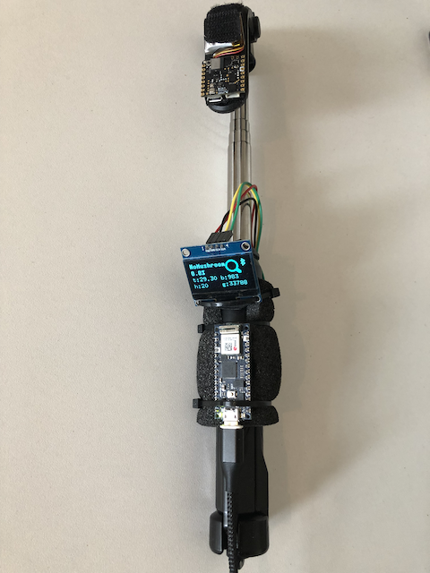
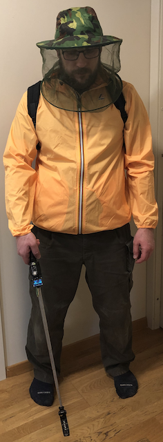

# MushroomDetector

Part of Arduino K-Way competition.

Classifies mushrooms using edge impulse and Arduino Nicla Sense Me.

[Edge Impulse MushroomDetector project](https://studio.edgeimpulse.com/public/181268/latest)

At the moment Nicla is mounted on a stick to be close as possible to the ground and displays results on a small screen. 
Depending on a real case test results which i plan to perform on upcoming mushroom season in a forest i might turn it into wrist watch or attach to a jacket in some way.
# Testing indoors
First testing phase indoors with dried boletus.

[Youtube video](https://youtu.be/0asNCFFJP08)

# Testing in forest
Waiting for the mushroom season to start.

# One more task while waiting
* Collecting data in the forest by controlling sampling from MushroomDetector device and ingest directly to edge impulse using mobile wifi hotspot.